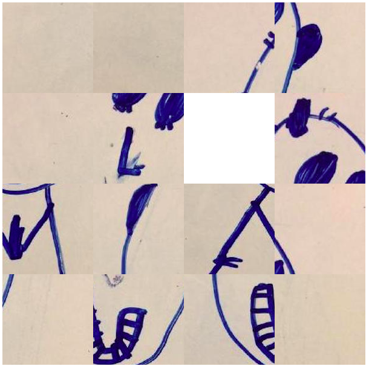

# Fifteen Puzzle

This is a simple ReasonML version of the 15 puzzle.

You can replace the image used with your own, its dimensions should be 600 x 600 pixels.



# Build
```
npm run build
npm run webpack_dev
```

# Play

open `./build/index.html` in a browser
